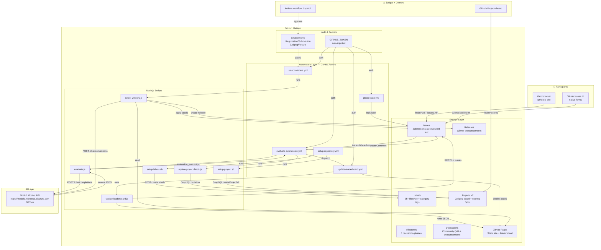
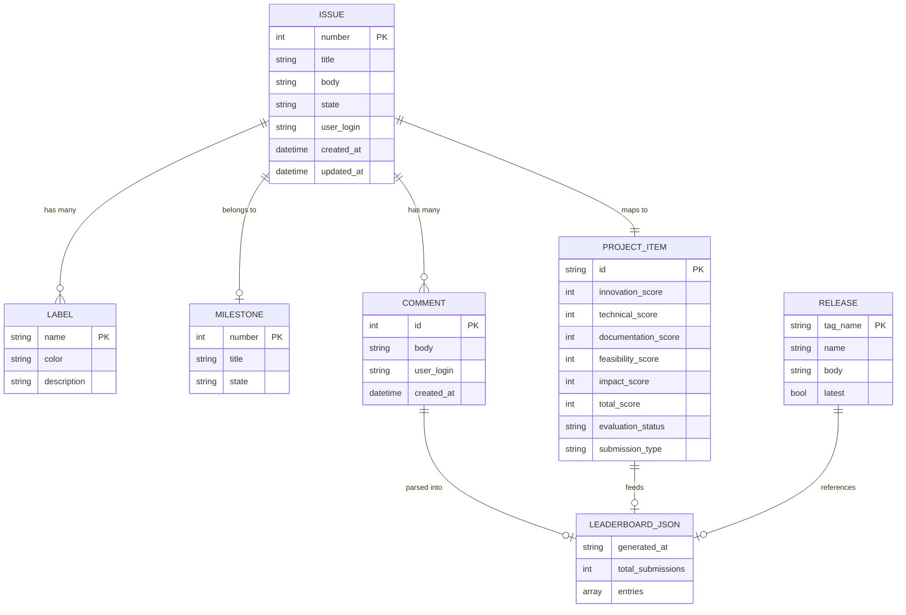
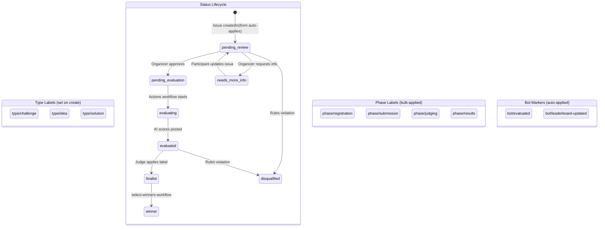
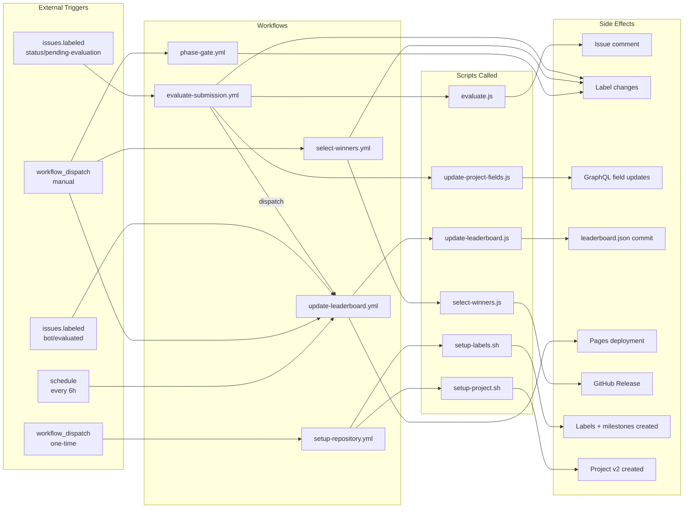
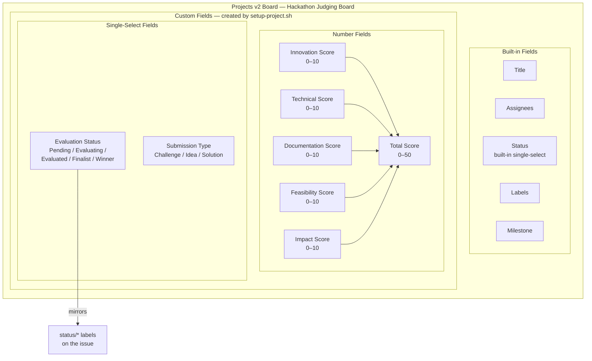
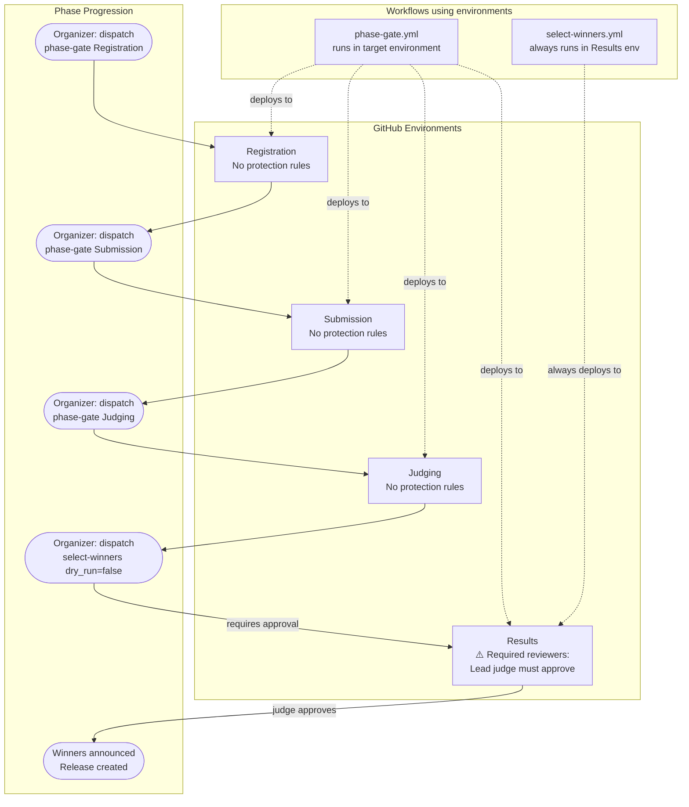
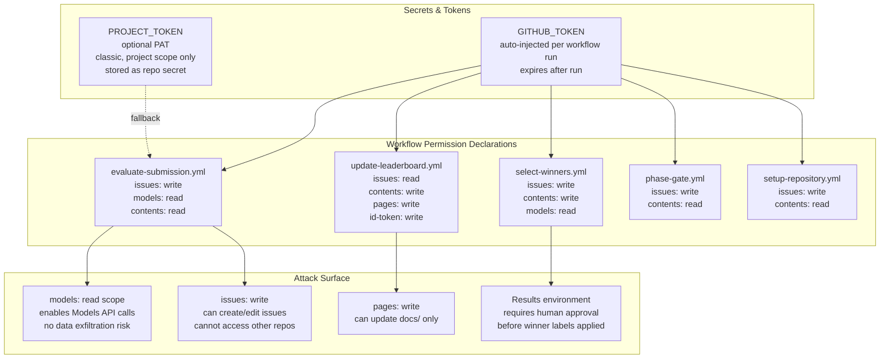

# Technical Architecture — GitHub Hackathon Platform

End-to-end technical reference for the GitHub-native hackathon platform. Every component is a GitHub built-in feature — no external servers, no databases.

---

## System Overview



---

## Data Model



---

## Evaluation Pipeline — Detailed Sequence

```mermaid
sequenceDiagram
    actor Participant
    participant GH as GitHub Issues
    participant Actions as GitHub Actions Runner
    participant Script as scripts/evaluate.js
    participant Models as GitHub Models API
    participant ProjScript as scripts/update-project-fields.js
    participant GraphQL as GitHub GraphQL API
    participant LBScript as scripts/update-leaderboard.js
    participant Pages as GitHub Pages

    Participant->>GH: Submit solution via Issue Form
    GH->>GH: Auto-apply labels:\ntype/solution\nstatus/pending-evaluation

    GH->>Actions: Webhook: issues.labeled\n{label: status/pending-evaluation}

    Actions->>Actions: Check conditions:\nlabel == pending-evaluation AND\nhas type/solution label

    Actions->>GH: Add label: status/evaluating
    Actions->>GH: Remove label: status/pending-evaluation

    Actions->>Script: node scripts/evaluate.js
    Note over Script: Env vars:\nGITHUB_TOKEN, ISSUE_BODY,\nISSUE_TITLE, ISSUE_NUMBER

    Script->>Script: Validate issue body\nnot empty

    loop Retry up to 3x with backoff
        Script->>Models: POST /chat/completions\n{model: gpt-4o,\nsystem: rubric,\nuser: issue body,\nresponse_format: json_object}
        Models-->>Script: {innovation, technical_quality,\ndocumentation, feasibility,\nimpact, rationale, summary}
    end

    Script->>Script: Validate scores 0-10\nRound to integers
    Script->>Actions: Write evaluation_json\nto GITHUB_OUTPUT

    Actions->>GH: POST /issues/{n}/comments\nFormatted score table + rationale

    Actions->>GH: Add labels:\nstatus/evaluated\nbot/evaluated
    Actions->>GH: Remove label: status/evaluating

    Actions->>ProjScript: node scripts/update-project-fields.js
    ProjScript->>GraphQL: query: find project by number
    GraphQL-->>ProjScript: project.id + field IDs
    ProjScript->>GraphQL: mutation: addProjectV2ItemById
    GraphQL-->>ProjScript: item.id

    loop For each score field (6 total)
        ProjScript->>GraphQL: mutation: updateProjectV2ItemFieldValue\n{number: score}
        GraphQL-->>ProjScript: updated
    end

    Actions->>Actions: workflow_dispatch\nupdate-leaderboard.yml

    Actions->>LBScript: node scripts/update-leaderboard.js
    LBScript->>GH: GET /issues?labels=type/solution,bot/evaluated
    GH-->>LBScript: All evaluated issues

    loop For each issue
        LBScript->>GH: GET /issues/{n}/comments
        GH-->>LBScript: Comments list
        LBScript->>LBScript: Find bot comment\nParse score table via regex
    end

    LBScript->>LBScript: Sort by total desc\nAssign ranks
    LBScript->>Pages: Write docs/_data/leaderboard.json
    Actions->>Pages: deploy-pages action\nPublish docs/ to github.io
    Pages-->>Participant: 🔔 Leaderboard updated
```

---

## Label State Machine



---

## GitHub Actions Workflow Dependency Graph



---

## GitHub Projects v2 Schema



---

## GitHub Environments — Phase Gate Architecture



---

## Leaderboard Data Pipeline

```mermaid
flowchart LR
    subgraph Source["Data Sources"]
        A[GitHub Issues API\nGET /issues?labels=\ntype/solution,bot/evaluated]
        B[GitHub Comments API\nGET /issues/n/comments]
    end

    subgraph Transform["Transform — update-leaderboard.js"]
        C[For each issue:\nfind bot evaluation comment]
        D[Regex parse score table\n5 dimension scores + total]
        E[Extract fields from body:\nteam, repo URL, challenge ref]
        F[Sort by total score desc\nAssign rank 1..N]
        G[Flag is_winner + is_finalist\nfrom label presence]
    end

    subgraph Output["Output"]
        H[docs/_data/leaderboard.json\n{generated_at, total, entries}]
        I[Git commit + push\nskip ci]
        J[GitHub Pages deploy\ndeploy-pages action]
        K[leaderboard.html\nfetch JSON client-side\nrender table + filter/sort]
    end

    A --> C
    B --> D
    C --> D
    D --> E --> F --> G --> H
    H --> I --> J --> K
```

---

## Security Model



---

## Component Inventory

| Component | Type | GitHub Feature | File Path |
|-----------|------|---------------|-----------|
| Challenge form | Input | Issue Form YAML | `.github/ISSUE_TEMPLATE/challenge-submission.yml` |
| Idea form | Input | Issue Form YAML | `.github/ISSUE_TEMPLATE/idea-submission.yml` |
| Solution form | Input | Issue Form YAML | `.github/ISSUE_TEMPLATE/solution-submission.yml` |
| Label definitions | Config | GitHub Labels | `.github/labels.yml` |
| AI evaluation | Workflow | GitHub Actions | `.github/workflows/evaluate-submission.yml` |
| Leaderboard refresh | Workflow | GitHub Actions | `.github/workflows/update-leaderboard.yml` |
| Winner selection | Workflow | GitHub Actions | `.github/workflows/select-winners.yml` |
| Phase transitions | Workflow | GitHub Actions | `.github/workflows/phase-gate.yml` |
| Bootstrap setup | Workflow | GitHub Actions | `.github/workflows/setup-repository.yml` |
| AI scoring logic | Script | Node.js | `scripts/evaluate.js` |
| Project field updater | Script | Node.js | `scripts/update-project-fields.js` |
| Leaderboard generator | Script | Node.js | `scripts/update-leaderboard.js` |
| Winner ranker | Script | Node.js | `scripts/select-winners.js` |
| Label bootstrap | Script | Bash + gh CLI | `scripts/setup-labels.sh` |
| Project bootstrap | Script | Bash + gh CLI | `scripts/setup-project.sh` |
| Landing page | Frontend | GitHub Pages | `docs/index.html` |
| Leaderboard page | Frontend | GitHub Pages | `docs/leaderboard.html` |
| Rules page | Frontend | GitHub Pages | `docs/rules.md` |
| Leaderboard data | Data | Jekyll `_data` | `docs/_data/leaderboard.json` |
| Styles | Frontend | GitHub Pages | `docs/assets/css/main.css` |
