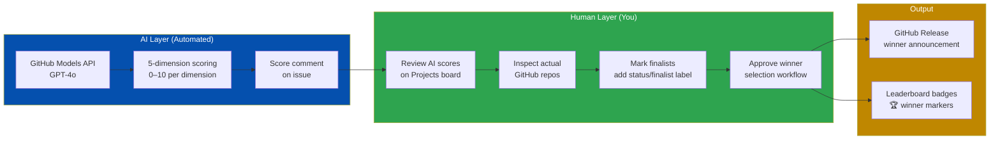
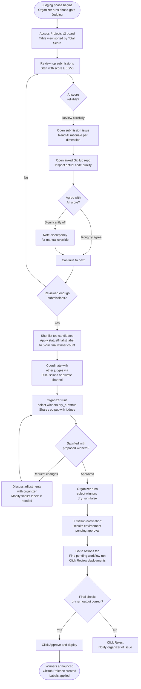
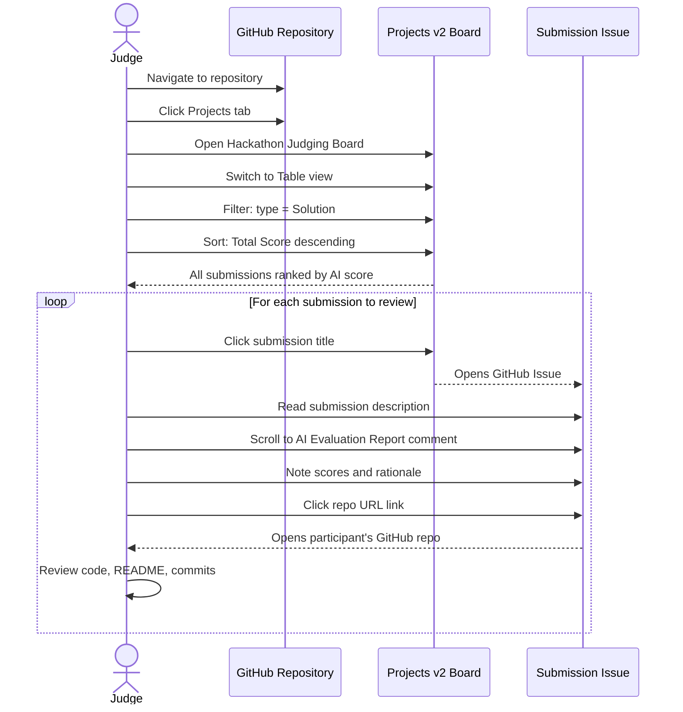
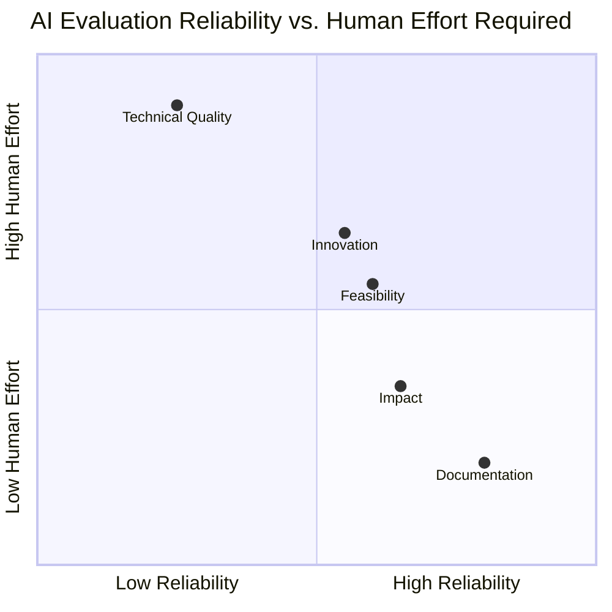
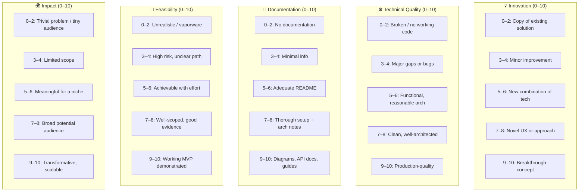
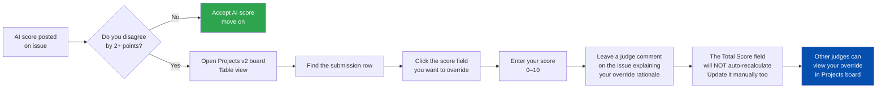
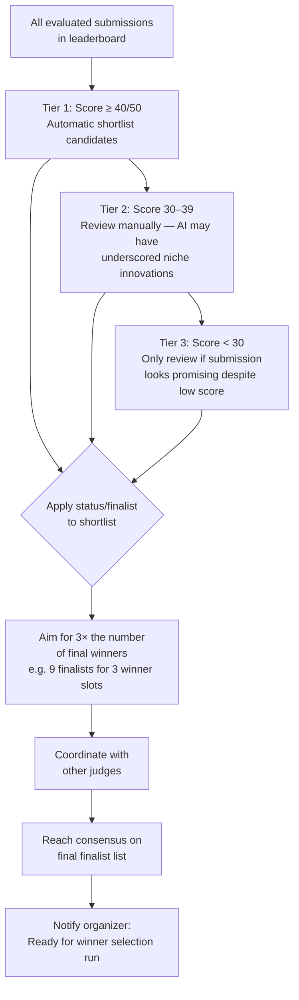
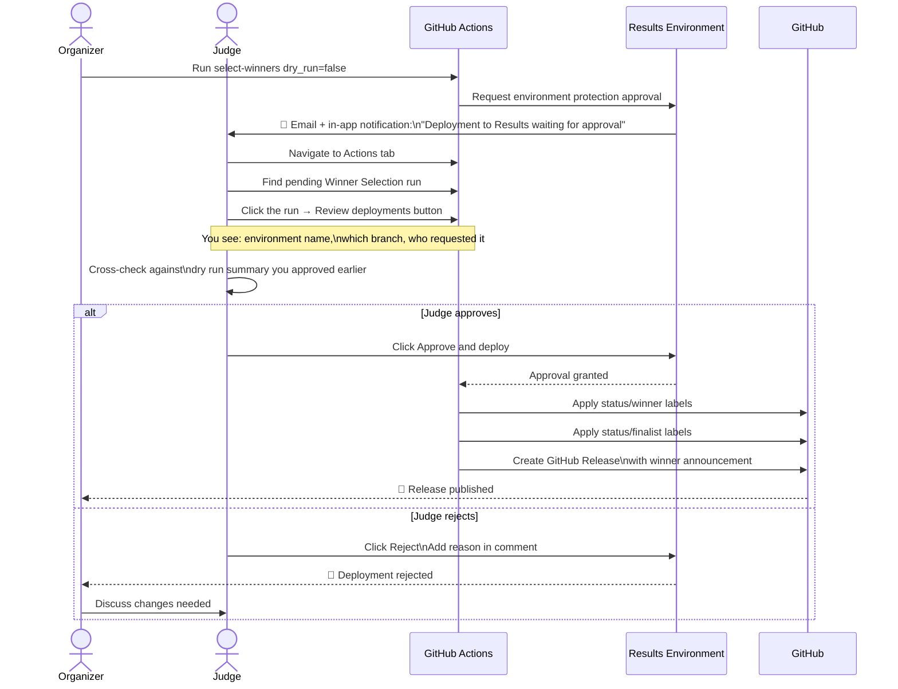
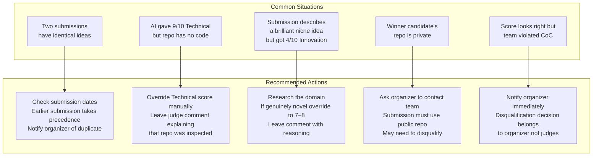

# Judge Guide — GitHub Hackathon Platform

> **Who this is for:** Human judges who review AI evaluation scores and finalize winner selections.

---

## Judge Role Overview

---

## End-to-End Judging Workflow

---

## Accessing the Judging Board

---

## AI Score Reliability by Dimension

| Dimension | AI Reliability | Why | Your Action |
|-----------|---------------|-----|-------------|
| **Documentation** | High | AI reads submission text directly | Spot-check only |
| **Impact** | Medium-High | AI evaluates claims in description | Sanity-check scale of claim |
| **Feasibility** | Medium | AI can't run the code | Check for working demo |
| **Innovation** | Medium-Low | AI may not know niche domains | Research comparables |
| **Technical Quality** | Low | AI cannot inspect the actual repo | Always review code manually |

---

## Scoring Rubric — Quick Reference Card

---

## Manual Score Override Process

When you disagree with an AI score, use this process:

> **Note:** Manual score overrides are made directly in the Projects v2 board fields. They do not change the AI evaluation comment on the issue — the comment is a record of the AI's assessment. Add your own comment on the issue to document your rationale.

---

## Finalist Selection Strategy

---

## Approving the Winner Announcement

---

## Common Issues & How to Handle Them

