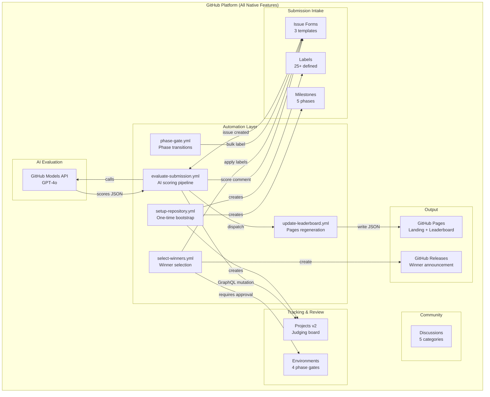
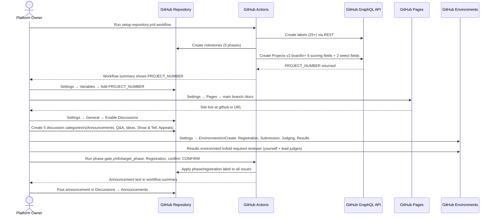
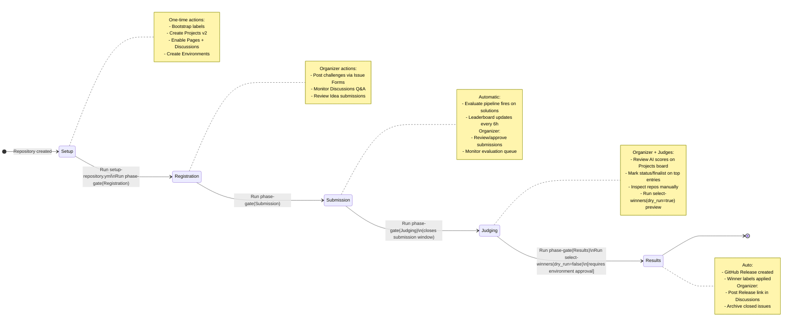
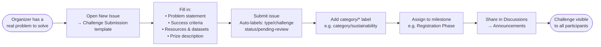
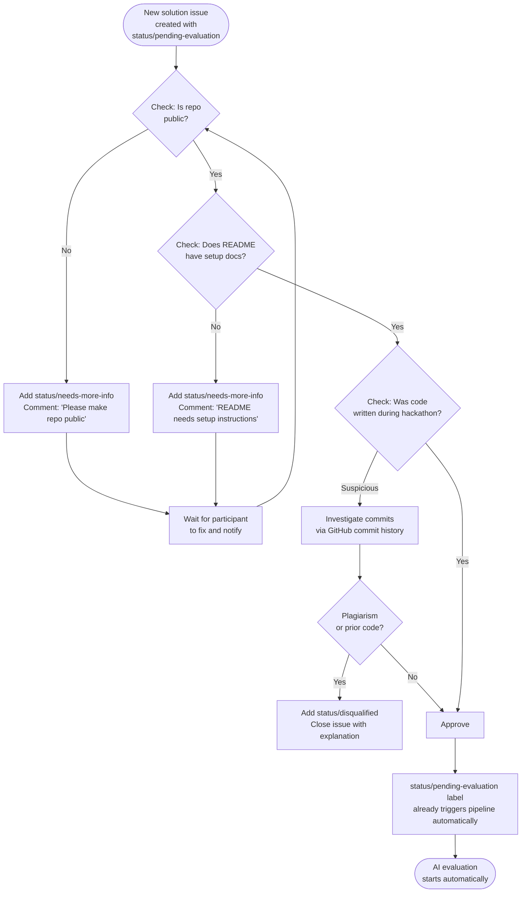
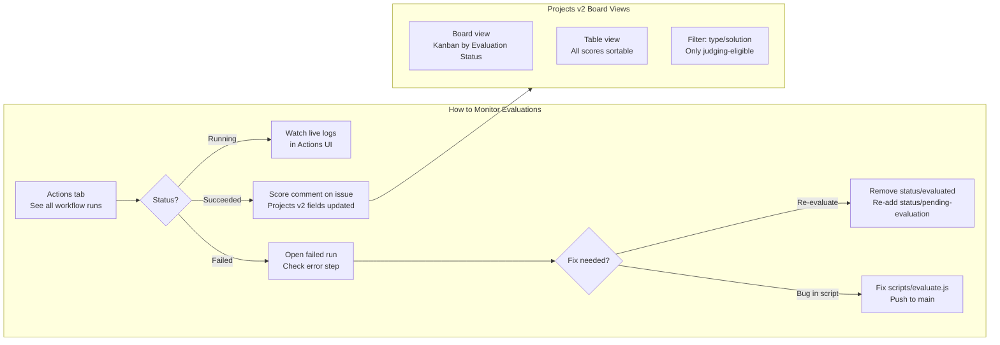
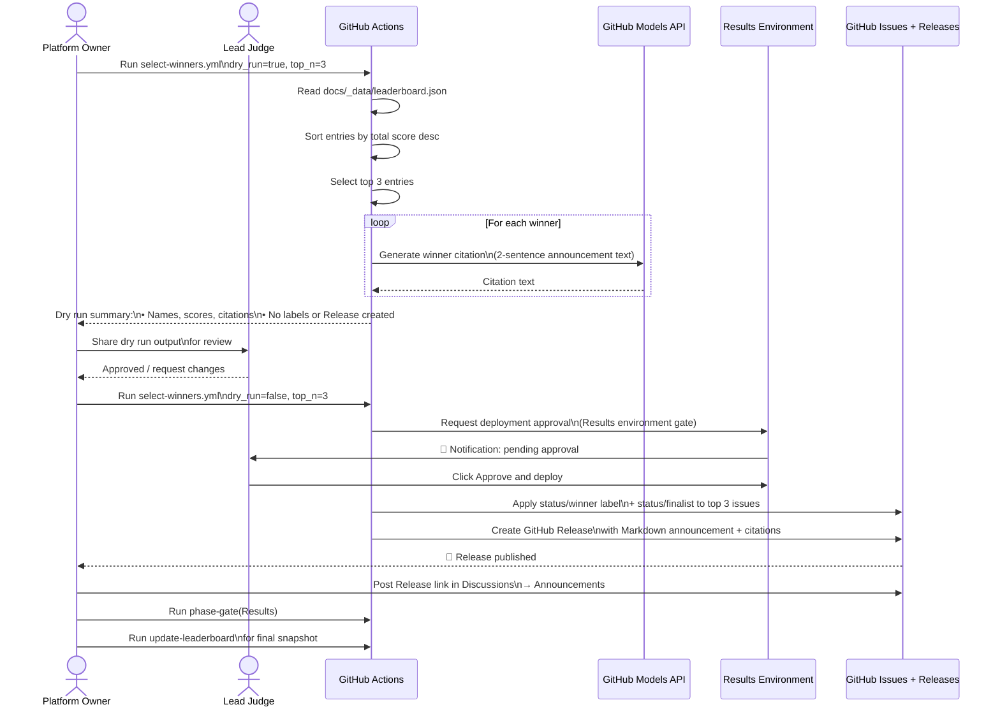
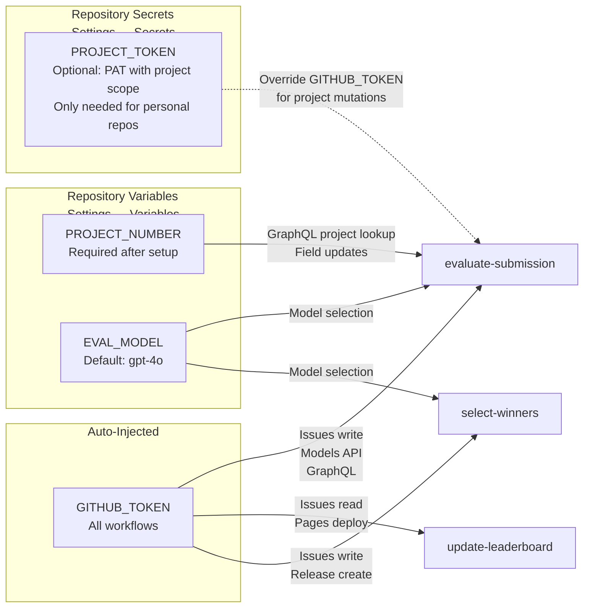

# Platform Owner Guide — GitHub Hackathon Platform

> **Who this is for:** Organizers who set up, operate, and manage the hackathon.

---

## Platform Overview



---

## First-Time Setup Sequence



---

## Hackathon Phase State Machine



---

## Challenge Posting Workflow



---

## Submission Review Decision Tree



---

## Evaluation Pipeline Monitoring



---

## Winner Selection Workflow



---

## Leaderboard Data Flow

```mermaid
flowchart TD
    subgraph Triggers["Workflow Triggers"]
        T1[Manual dispatch]
        T2[Schedule: every 6h]
        T3[Issue labeled bot/evaluated]
    end

    T1 & T2 & T3 --> WF[update-leaderboard.yml\nGitHub Actions]

    WF --> API[GitHub REST API\nFetch issues: type/solution + bot/evaluated]
    API --> ISSUES[List of evaluated\nsolution issues]
    ISSUES --> PARSE[Parse AI evaluation comment\nExtract scores via regex]
    PARSE --> JSON[Write docs/_data/leaderboard.json\n{rank, title, team, scores, is_winner...}]
    JSON --> COMMIT[Git commit + push to main\n'chore: update leaderboard data skip ci']
    COMMIT --> PAGES[GitHub Actions deploy-pages\nPublish docs/ to GitHub Pages]
    PAGES --> SITE[Live site updated\nleaderboard.html reads JSON via fetch]

    style SITE fill:#2ea44f,color:#fff
```

---

## Repository Variables & Secrets Reference



---

## Operational Checklist

```mermaid
graph TD
    subgraph PreLaunch["Pre-Launch ✅"]
        C1[Run setup-repository.yml]
        C2[Set PROJECT_NUMBER variable]
        C3[Enable GitHub Pages]
        C4[Enable Discussions]
        C5[Create 5 Discussion categories]
        C6[Create 4 Environments]
        C7[Add reviewer gate on Results env]
        C8[Post at least 1 challenge]
        C9[Run phase-gate Registration]
        C10[Test evaluation with a dummy issue]
    end

    subgraph DuringHackathon["During Hackathon 🔄"]
        D1[Review incoming submissions daily]
        D2[Monitor Actions for failed evaluations]
        D3[Respond to Discussions Q&A]
        D4[Watch leaderboard for anomalies]
    end

    subgraph PostHackathon["Post-Hackathon 🏁"]
        P1[Run phase-gate Judging]
        P2[Coordinate judge review of finalists]
        P3[Run select-winners dry_run=true]
        P4[Get judge approval on dry run output]
        P5[Run select-winners dry_run=false]
        P6[Judge approves Results environment]
        P7[Post Release link in Discussions]
        P8[Run phase-gate Results]
        P9[Final leaderboard update]
    end

    C1-->C2-->C3-->C4-->C5-->C6-->C7-->C8-->C9-->C10
    C10 --> D1
    D1-->D2-->D3-->D4
    D4 --> P1
    P1-->P2-->P3-->P4-->P5-->P6-->P7-->P8-->P9
```


