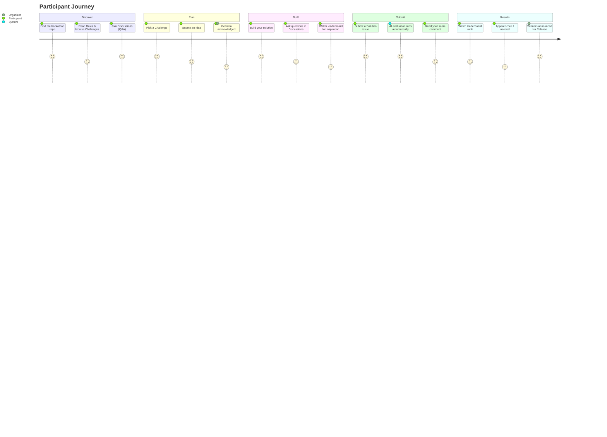
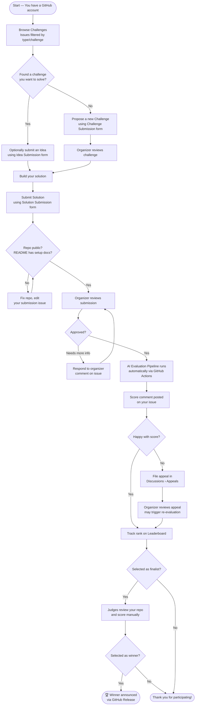
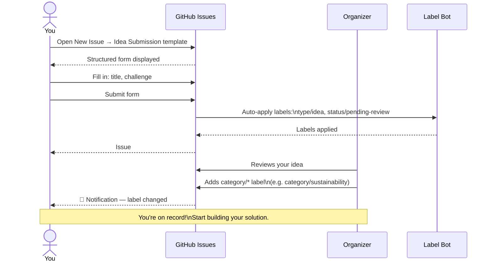
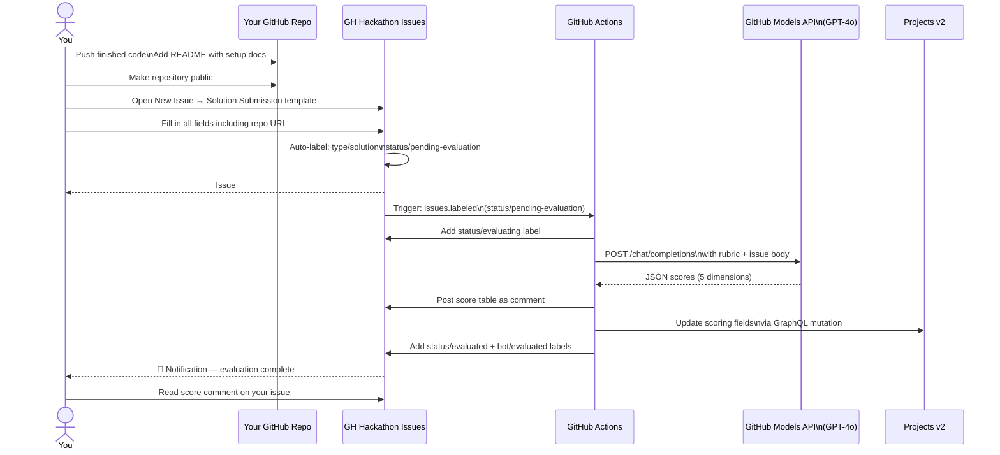
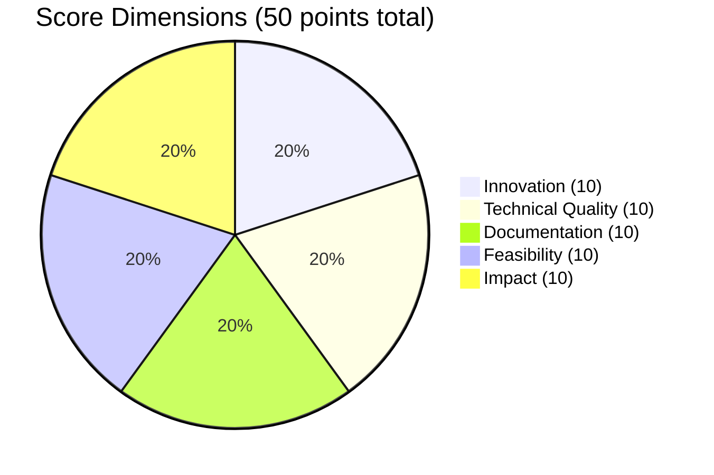
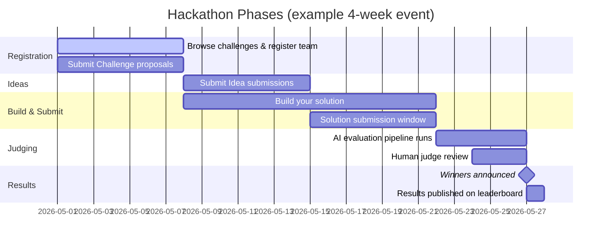

# Participant Guide — GitHub Hackathon Platform

> **Who this is for:** Anyone submitting a Challenge, Idea, or Solution to the hackathon.

---

## Your Journey at a Glance



---

## Submission Flow



---

## Submission Status States

```mermaid
stateDiagram-v2
    direction LR

    [*] --> pending_review : Submit issue\n(auto-label applied)
    pending_review --> pending_evaluation : Organizer approves
    pending_review --> needs_more_info : Organizer requests\nclarification
    needs_more_info --> pending_review : You update issue\nor reply to comment

    pending_evaluation --> evaluating : Actions workflow\ntriggered
    evaluating --> evaluated : AI scores posted\nas issue comment

    evaluated --> finalist : Judge applies\nfinalist label
    finalist --> winner : Winner selected\nby organizer workflow
    finalist --> evaluated : Not selected\n(still evaluated)

    pending_review --> disqualified : Rules violation
    evaluated --> disqualified : Rules violation

    winner --> [*]
    disqualified --> [*]

    state pending_review { }
    state needs_more_info { }
    state pending_evaluation { }
    state evaluating { }
    state evaluated { }
    state finalist { }
    state winner { }
    state disqualified { }
```

---

## How to Submit an Idea



---

## How to Submit a Solution



---

## Understanding Your Score



| Score Range | Tier | What it means |
|-------------|------|--------------|
| 45–50 | 🏆 Exceptional | Top-tier, production-ready, highly innovative |
| 35–44 | 🥇 Strong | Solid execution, good documentation, real impact |
| 25–34 | 🥈 Good | Functional but has gaps — consider improving docs or scope |
| 15–24 | 🥉 Developing | Core idea is there but implementation needs more work |
| 0–14 | ⚠️ Needs work | Submission is incomplete or very early stage |

---

## Timeline Overview



---

## Key Links

| Resource | Link |
|----------|------|
| Submit (any type) | [New Issue → Choose template](https://github.com/akashtalole/gh-hackathon-platform/issues/new/choose) |
| Browse challenges | [Issues filtered by type/challenge](https://github.com/akashtalole/gh-hackathon-platform/issues?q=label:type/challenge) |
| Live leaderboard | [Hackathon website leaderboard](https://akashtalole.github.io/gh-hackathon-platform/leaderboard.html) |
| Discussions | [Community Q&A and Ideas](https://github.com/akashtalole/gh-hackathon-platform/discussions) |
| Rules | [Full rules page](https://akashtalole.github.io/gh-hackathon-platform/rules.html) |
| Appeals | [Discussions → Appeals](https://github.com/akashtalole/gh-hackathon-platform/discussions/categories/appeals) |
